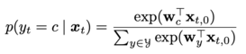
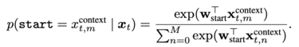
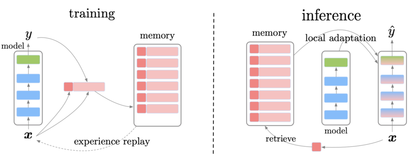
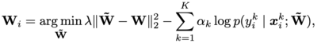

# Episodic Memory in Lifelong Language Learning
Code for the paper: `Episodic Memory in Lifelong Language Learning`[(Arxiv:1905.12926)](https://arxiv.org/pdf/1906.01076v3.pdf) for the text classification setup.
## Introduction
The ability to continuously learn and accumulate knowledge throughout a lifetime and reuse it effectively to adapt to a new problem quickly is a hallmark of general intelligence. State-of-the-art machine learning models work well on a single dataset given enough training examples, but they often fail to isolate and reuse previously acquired knowledge when the data distribution shifts (e.g., when presented with a new dataset)—a phenomenon known as catastrophic forgetting. In this paper, the authors  introduce a lifelong language learning setup where a model needs to learn from a stream of text examples without any dataset identifier. Specificaly, they propose an episodic memory model that performs sparse experience replay and local adaptation to mitigate catastrophic forgetting in this setup. Experiments on the text classification and question answering tasks demonstrate that the episodic memory module is a crucial building block of general linguistic intelligence.

## Model
Main components of the model are:
* ### Example Encoder:
  * <strong><ins>Text Classification</ins></strong>: xt is a document to be classified; BERT produces a vector representation of each token in xt, which includes a special beginning-of-document symbol CLS as xt,0.   
  * <strong><ins>Question Answering</ins></strong>: xt is a concatenation of a context paragraph xtcontext and a question xtquestion separated by a special separator symbol SEP.
* ### Task Decoder:
  * <strong><ins>Text classification</ins></strong>: following the original BERT model, select the representation of the first token xt,0 from BERT (i.e., the special beginning-of-document symbol) and add a linear transformation and a softmax layer to predict the class of xt. The probability of the text being classified as class c is computed as:   
   
  * <strong><ins>Question Answering</ins></strong>: The decoder predicts an answer span—the start and end indices of the correct answer in the context.
The probability of each context token being the start of the answer is computed as:
   
where xt,mcontext is the encoded representation of mth token in the context.   
The probability of the end index of the answer analogously using wend. The predicted answer is the span with the highest probability after multiplying the start and end probabilities.    
*Note:* To take into account that the start index of an answer needs to precede its end index by setting the probabilities of invalid spans to zero.
* ### Episodic Memory:
  * <strong><ins>Architecture</ins></strong>: The model is augmented with an episodic memory module that stores previously seen examples throughout its lifetime. The module is a key-value memory block. The key representation of xt (denoted by u) is obtained using a key network—which is a pretrained BERT model separate from the example encoder. The key network is freezed to prevent key representations from drifting as data distribution changes.     
   *Text Classification*: The key is an encoded representation of the first token of the document to be classified, so      ut = xt,0 (i.e., the special beginning-of-document symbol).       
   *Question Answering*: The key is the encoded representation of the first token of the question, so ut = xt,0question.
   For both tasks, the input and the label ⟨xt , yt ⟩ is stored as its associated memory value.
  * <strong><ins>Write</ins></strong>:
   In this paper, the authors have suggested to randomly decide whether to write a newly seen example into the memory with some probability.
   * <strong><ins>Read</ins></strong>:
   The memory has two retrieval mechanisms: (i) random sampling and (ii) K-nearest neighbors
## Training and Inference
Illustration of training and inference:

### Sparse experience replay:
At a certain interval(1% replay rate) throughout the learning period, uniformly sample from stored examples in the memory and perform gradient updates of the encoder-decoder network based on the retrieved examples. It helps mitigate catestophic forgetting.
### Local Adaptation:
At inference time, given a test example, a query vector of the test example is obtained using the key network and query the memory to retrieve K nearest neighbors using the Euclidean distance function. These K examples are used to perform local adaptation. Gradient-based local adaptation to update parameters of the encoder-decoder model—denoted by W—to obtain local parameters Wi to be used for the current prediction as follows:

𝝀 is a hyperparameter, ⍺k is the weight of the retrieved examples equal to 1/k.
*Note*: Wi is only used to make a prediction for the i-th example, and the parameters are reset to W afterwards. In practice, only L local adaptation gradient steps are performed instead of finding the true minimum of the above equation.
## Documents

### Dependencies
	Run pip3 install -r requirements.txt to download all the dependencies
	
### Directory description

<pre><code>Root
├─data/*        Store the data files used by models.
├─baselines/*   Store the source code of the various baseline models.
└─models/*     Store the sorce code for target model.
</code></pre>
